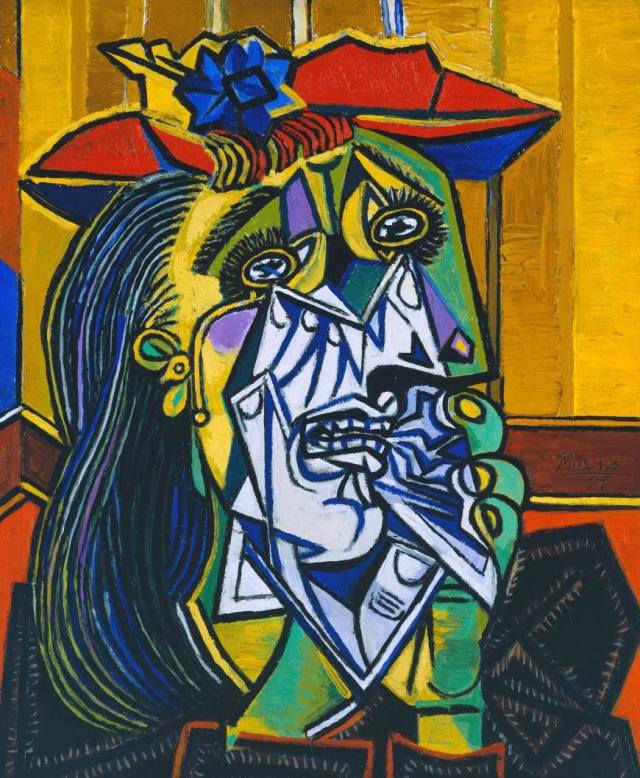
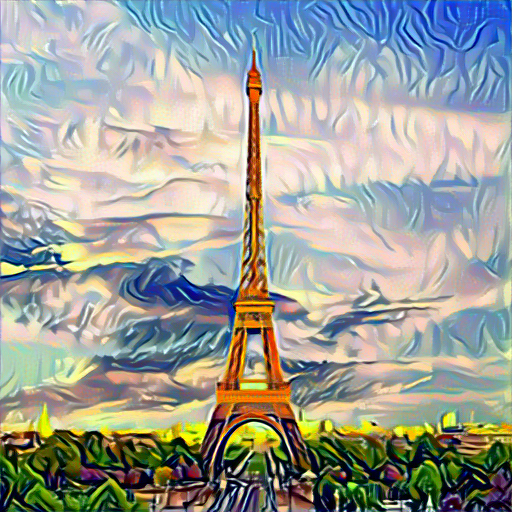

# Gatys
- This is the reproduction of basic style transfer algorithm, "A Neural Algorithm of Artistic Style".
- I wrote this code based on this tutorial, "https://pytorch.org/tutorials/advanced/neural_style_tutorial.html"

## Example
##### content image

##### style image

##### result

##### condition
- itersize: 50
- style weight: 100000
- content weight: 1
- content_loss: conv_4
- style_loss: conv_1,conv_2,conv_3,conv_4,conv_5
